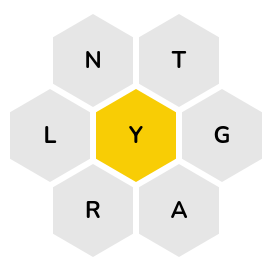

# Lab: SpellingBee

Are you familiar with [SpellingBee](https://www.nytimes.com/puzzles/spelling-bee)? Is it blocked at school? It looks like this:

The puzzle is to find words using only those letters (multiple use is allowed) which include the letter in the middle. For example, GNARLY or ARRAY.

I am bad at these games, and prefer to cheat. Let's build a solver.

I found a wordlist [online](https://github.com/first20hours/google-10000-english), but on the way into class I dropped it.
[words_dropped.txt](words_dropped.txt)
Ok, fine, it's just sorted by frequency rather than alphabetical. "Dropped it" is a better story.

There are not quite 10,000 words in the wordlist. There were 10,000 words, but they removed profane words. This wordlist is pretty sad, it doesn't even have 'gnarly'! If you choose a better wordlist, make sure not to notice the bad words.

First, let's load it and sort it, using your homework.

Next, let's build a SpellingBee solver. `toCharArray` method on Strings may be useful.

Loop through the wordlist and check if a word solves SpellingBee:

- does it use only the allowed letters?
- does it use the required letter?
- is it at least 4 characters?

How many words did your solver find?

Note that this is not especially efficient code. How might we optimize our code?

## Lab Checkpoints

- Lab Code: [`SpellingBee.java`](SpellingBee.java)

Within the code, there is a series of TODOs. This is what you are asked to work on.

- The `main` function already loads the words for you. Run it, and verify it prints "Loaded 9894 words"
- Build the SpellingBee constructor. (Hint VS Code has a "generate constructor" action behind the 💡)
- next, implement method `checkWord` according to the specifications above. (Matches the letters, etc.)
- Tada! Back in the `main` function, Write a loop which calls `checkWord` on each of the words and prints out the ones which match.
- Next, did you do option B for [Tuesday's homework](../10-5.md#homework)? Sort the `words` array! If you did not do option B, you could use [`Arrays.sort`](https://docs.oracle.com/javase/8/docs/api/java/util/Arrays.html#sort-java.lang.Object:A-). (Or you could do option B now.)
- Finally, write some code to find the index of the word "search" in the sorted array of words, by looping over the words. This is called a linear or sequential search.
